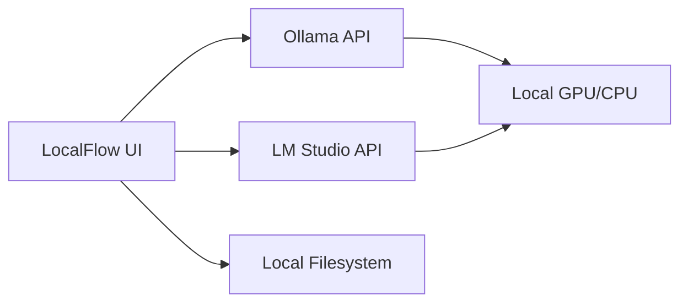

# <p align="center"><br/>LocalFlow Studio</p>

<p align="center">
  
  
  
</p>

---

**LocalFlow** is a lightweight, high-performance alternative to Roboflow designed to run entirely on your localhost. It bridges the gap between local Vision-Language Models (VLMs) and traditional computer vision training pipelines by providing an intuitive studio for labeling, testing, and exporting datasets without your data ever leaving your machine.

## ✨ Key Features

### 🧪 Inference Playground
- **Dual-Model Comparison**: Run side-by-side inference with two different local backends.
- **Dynamic Discovery**: Auto-detect models from your running Ollama or LM Studio instances.
- **Zero-Shot Testing**: Provide text-based instructions to VLMs and visualize bounding boxes in real-time.

### 🧠 Batch Auto-Studio
- **Auto-Labeling**: Harness the power of local LLMs (like LLaVA or Moondream) to pre-annotate thousands of images.
- **Bulk Management**: Drag-and-drop workspace for high-speed local data orchestration.
- **Privacy-First**: No cloud uploads. Your datasets stay in your filesystem.

### 📦 YOLO Precision Export
- **One-Click Formatting**: Automatically structure your data for YOLOv8 or YOLO11.
- **Path Management**: Select your local training directory via the Native File System API.
- **Training Ready**: Generates standard folder structures (`/images`, `/labels`) and the necessary `data.yaml`.

## 🚀 Getting Started

### 1. Prerequisites
You need a local AI server running to use the auto-labeling and playground features:
- **[Ollama](https://ollama.com)**: Running on `http://localhost:11434`
- **[LM Studio](https://lmstudio.ai)**: Local Server enabled on `http://localhost:1234`

### 2. Installation
LocalFlow is a standalone web application. Simply serve the root directory or run via your preferred frontend tool:
```bash
# Using npm
npm install
npm run dev
```

## 🛠 Workflow

1.  **Drop & Discover**: Drag your raw images into the **Annotator**.
2.  **Configure AI**: Connect to an Ollama model (e.g., `moondream` or `llava`).
3.  **Prompt & Process**: Tell the model what to look for (e.g., "Label all traffic cones and safety vests").
4.  **Refine**: Verify the auto-generated boxes.
5.  **Export**: Select your project folder and hit **Export YOLOv11**.

---

## 🏗 System Architecture

LocalFlow communicates directly with local inference servers using OpenAI-compatible endpoints (`/v1/models`).



## 📜 License
MIT License - Created for developers who value data privacy and local-first AI development.

---
<p align="center">Made with ❤️ for the Computer Vision Community</p>
